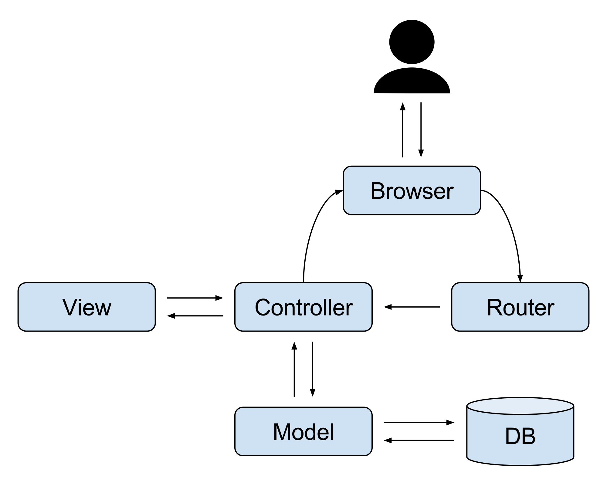
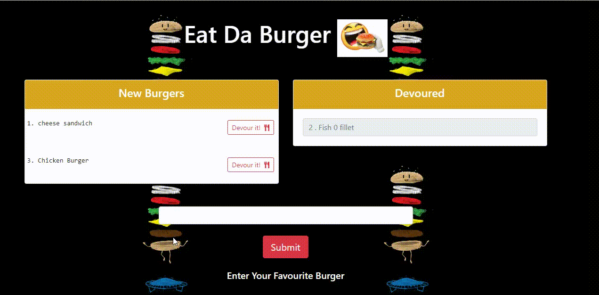

# Eat Da Burger

### Deployed Heroku URL:
https://desolate-garden-68905.herokuapp.com/burgers


## Badges
[](https://img.shields.io/github/followers/sujatha-m?style=social)
[](https://img.shields.io/website?url=https%3A%2F%2Fsujatha-m.github.io%2FWeather-Dashboard%2FDevelop%2F)
[](https://img.shields.io/redmine/plugin/stars/redmine_xlsx_format_issue_exporter?color=purple)

## Table of Contents
   * [Description](#description)
   * [Usage](#usage)
   * [Built with](#built-with)
   * [Installation](#installation)
   * [Badges](#badges)
   * [Contributing](#contributing)
   * [License](#license)
   * [Visuals](#visuals)

## Description
**E**at-**D**a-**B**urger! is a restaurant app that lets users input the names of burgers they'd like to eat.

Whenever a user submits a burger's name, the app will display the burger on the left side of the page -- waiting to be devoured.

Each burger in the waiting area also has a Devour it! button. When the user clicks it, the burger will move to the right side of the page with customer.

The app will store every burger in a database, whether devoured or not.

## Functionality and MVC
The app is esentially a demonstration of different http requests executed with Express. The First thing that the app registers is the server.js file. Within that file are all of the routes and imported information from the MVC structure that are necessary to run the app. From the Back to the front, this is how the app functions...

**D**B Files
The database files are pretty self explanatory; the schemal.sql is the code that created the burgers_db database in MySQL, and the seeds.sql file contains the queries that were run to populate the table with the initial data.

**C**onfig Files
The config directory contains two files: connection.js and orm.js. The connection.js file is simply the code to connect the app to MySQL database. The orm.js file sets the groundwork for multiple functions that are at the core of the app's functionality. The three functions that are exported within the orm object are as follows

* selectAll(): Executes a simple "SELECT * FROM TABLE" query where the table is passed in as a parameter of the function. The data is stored into a callback so that it can run asynchronously.

* insertOne(): executes a "INSERT INTO ___ VALUES(_____,____)" query i.e adds a new item into the table with the correct data. The syntax on this one tripped me up for a while, but the formatting functions made it easier.

* updateOne(): This function executes a "UPDATE TABLE ____ SET ___ WHERE ____" query. This function is used to update the burgers "devoured" attribute from 0 to 1

**M**odel/Controller Files
The burger.js file in the models directory essentially just re-exports the orm functions with particular syntax to talk to the burgers_db database.

Once the burger.js model is exported, it is the grabbed by the burger_controller.js file with a require() statement. The controller file serves as the "rulebook" for whenever there is an http get/post/put request given to the api. The controller uses an express router to handle the following requests.

* get request for "/burgers" url: Sends all of the burger data as a JSON response. It then renders the index.handlebars page with the data it received.

* Post request for "/burgers/insertOne: sends a new data row into the table and then returns the JSON data.

* Put request for "/burgers/:id": edits the information in the table where the id matches the id of the burger that the user clicked on. It then sends back the data as a JSON object.

* get request for "/" Re-direct to the main "/burgers" page.

**P**ublic Files
The public files are pretty self explanatory. There is a stylesheet, and image foleder, and a client-side javascript file that handles the click events. It is within these click events that the get/post/put requests are actually issued with AJAX calls.

**V**iews Files
The views files are just the client-side html formatted with handlebars to take data from the burgers object (passed into the file with the burger_controllers.js file). The main.handlebars file that is found in the layouts directory acts as the head of the html page, where the index.handlebars file acts as the body. I used bootstrap, fontawesome, and google fonts for style points.

## MVC Flow Diagram:



## Built with
* JavaScript
* NodeJS
* Node Packages:
* MYSQL2
* Express
* Express-handlebars

## Visuals



## Installation 
Run npm install to install all dependencies. To use the application locally run server.js

## Usage
```sh
      node server.js  
```

## Contributing
Pull requests are welcome. For major changes, please open an issue first to discuss what you would like to change.
Please make sure to update tests as appropriate.


## License 
[](https://img.shields.io/npm/l/isc?color=Blue&style=plastic)

## Questions
# 

jhanavi.bhushan@gmail.com


